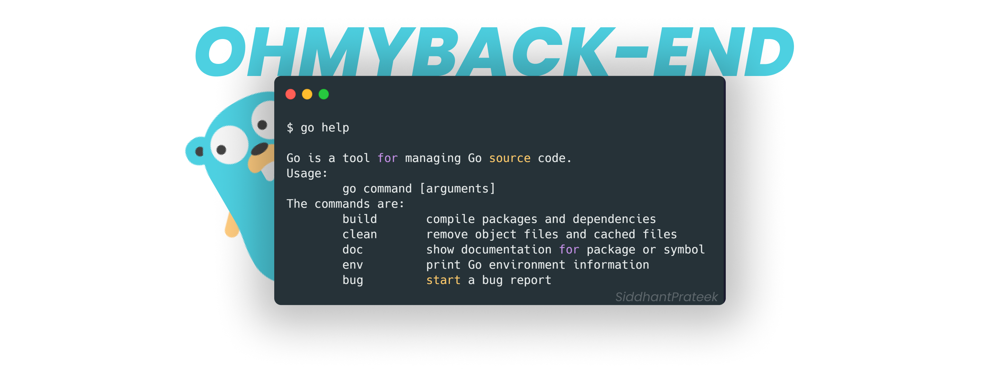

# ohmyback-end

## Journey
- [x] Create REST API using Golang
- [x] Integration of Graphql and Document based database - MongoDB
- [ ] Integration of Realtime database like firebase with Golang
- [ ] Integration of Cassandra - Column-based database with Golang
- [ ] JWT Token Authorization using Golang
- [ ] Auth0 authorization using Golang
- [ ] Redis Integration with Golang - Caching
- [ ] Web Security using Golang
- [ ] Create gRPC using Golang